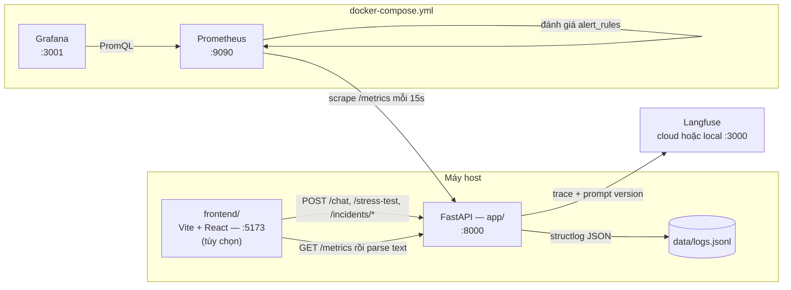
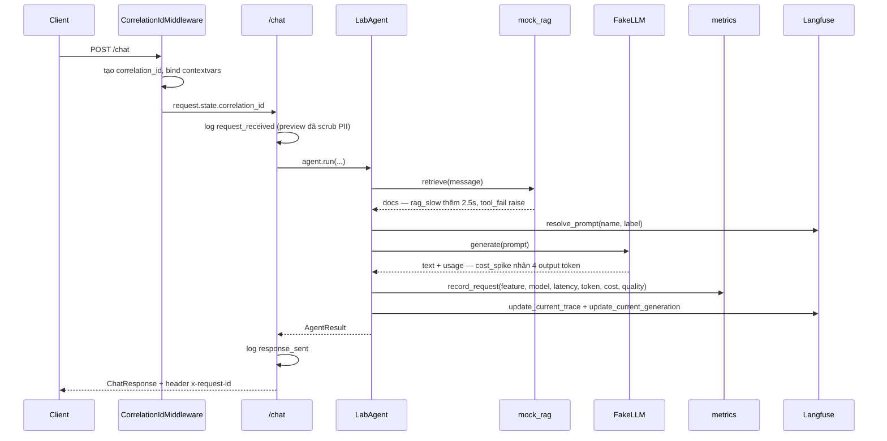

# Kiến trúc hệ thống Day 13

Tài liệu này mô tả các thành phần của repo, đường đi của dữ liệu quan sát và những quyết định thiết kế đứng sau. Dùng nó khi cần hiểu tổng thể trước khi sửa code, hoặc khi phải giải thích hệ thống trong buổi chấm.

Hướng dẫn thao tác nằm ở nơi khác: cài đặt trong [SETUP.md](../SETUP.md), dựng dashboard trong [DASHBOARD_SETUP.md](DASHBOARD_SETUP.md), alert trong [alerts.md](alerts.md).

## 1. Ý tưởng trung tâm

Hệ thống là một API AI cỡ nhỏ được bọc bởi bốn lớp tín hiệu độc lập. Mỗi lớp trả lời một câu hỏi khác nhau, và bài lab yêu cầu nối cả bốn lại thành một chuỗi bằng chứng.

| Lớp | Trả lời câu hỏi | Nơi lưu | Công cụ đọc |
|---|---|---|---|
| Metrics | *Có gì bất thường, từ lúc nào?* | Prometheus TSDB | Grafana, PromQL |
| Traces | *Bất thường nằm ở bước nào?* | Langfuse | Langfuse UI |
| Logs | *Vì sao bước đó hỏng?* | `data/logs.jsonl` | `validate_logs.py`, grep |
| Prompt version | *Request đó chạy prompt nào?* | Langfuse Prompts | Langfuse UI |

Luồng điều tra bắt buộc là **Metrics → Traces → Logs**. Kiến trúc được dựng để mỗi mũi tên đó có một khoá nối cụ thể: metrics có label `feature`/`model`, trace có `session_id` và metadata prompt, log có `correlation_id`.

## 2. Sơ đồ runtime

Ba tiến trình chạy ngoài Docker: API, frontend và các script. Chỉ Prometheus và Grafana nằm trong compose. Đó là lý do Prometheus phải gọi ngược về host qua `host.docker.internal` và API phải bind `0.0.0.0`.

## 3. Vòng đời một request `/chat`

Điểm cần nhớ: **metrics được ghi trong `agent.py`, không phải trong middleware**. Vì vậy `ai_requests_total` đếm số lần agent chạy, không đếm mọi HTTP request tới app. `/health` và `/metrics` không xuất hiện trong metrics nghiệp vụ.

Đường lỗi đi qua `record_error()` trong [main.py](../app/main.py) — đó là chỗ duy nhất cộng `status="error"` vào `ai_requests_total`, nên nếu bỏ sót thì mẫu số của error rate sẽ sai.

## 4. Bản đồ module

### `app/` — API và instrumentation

| File | Trách nhiệm |
|---|---|
| [main.py](../app/main.py) | FastAPI app, route `/chat`, `/health`, `/metrics`, `/incidents/*`, `/stress-test` |
| [middleware.py](../app/middleware.py) | Sinh và truyền `correlation_id`, gắn response header |
| [agent.py](../app/agent.py) | Điều phối RAG → prompt → LLM, tính cost/quality, ghi metrics và trace |
| [metrics.py](../app/metrics.py) | Định nghĩa 6 metric Prometheus, hàm ghi và render exposition |
| [logging_config.py](../app/logging_config.py) | Pipeline processor của structlog, ghi JSONL |
| [pii.py](../app/pii.py) | Regex redaction và hash user id |
| [tracing.py](../app/tracing.py) | Adapter Langfuse v3, có fallback khi thiếu SDK/key |
| [prompt_management.py](../app/prompt_management.py) | Lấy prompt theo name/label, fallback local có gắn nhãn nguồn |
| [mock_rag.py](../app/mock_rag.py), [mock_llm.py](../app/mock_llm.py) | Thay thế retrieval và LLM thật, là nơi incident tác động |
| [incidents.py](../app/incidents.py) | Cờ bật/tắt ba kịch bản sự cố, lưu trong bộ nhớ tiến trình |
| [challenge.py](../app/challenge.py) | Đọc và kiểm tra `config/challenge.json` do Lab Coach release |
| [schemas.py](../app/schemas.py) | Pydantic model của request/response và log record |

### `config/` — các contract

| File | Vai trò | Ai đọc |
|---|---|---|
| [dashboard.yaml](../config/dashboard.yaml) | Contract 6 panel: metric, aggregation, PromQL, đơn vị, threshold | `validate_dashboard.py`, người dựng dashboard |
| [prometheus.yml](../config/prometheus.yml) | Scrape config và đường dẫn rule file | Prometheus |
| [alert_rules.yaml](../config/alert_rules.yaml) | Alert rule dạng Prometheus | Prometheus, `validate_dashboard.py --alerts` |
| [slo.yaml](../config/slo.yaml) | SLI/SLO và PromQL tương ứng | Con người, dùng để chọn threshold |
| [logging_schema.json](../config/logging_schema.json) | Trường bắt buộc của một log record | Con người, `validate_logs.py` |
| [challenge.json](../config/challenge.json) | Kịch bản chấm điểm chính thức | `app/challenge.py` |

### Thành phần còn lại

- `grafana/provisioning/` — datasource (uid `day13-prometheus`) và dashboard provider, nạp tự động khi container khởi động.
- `grafana/dashboards/` — dashboard JSON đã export; đây là nơi công việc của nhóm được đưa vào Git.
- `scripts/` — bộ sinh tải và ba validator, xem mục 6.
- `frontend/` — UI React tùy chọn, xem mục 8.
- `tests/` — public test, chạy được mà không cần Docker hay Langfuse.

## 5. Mô hình metric

Sáu metric trong [metrics.py](../app/metrics.py), tên được cố định vì cả dashboard contract lẫn alert rule đều tham chiếu tới.

| Metric | Loại | Label | Dùng cho panel |
|---|---|---|---|
| `ai_requests_total` | Counter | `feature`, `model`, `status` | traffic, mẫu số của errors |
| `ai_request_latency_seconds` | Histogram | `feature`, `model` | latency P50/P95/P99 |
| `ai_errors_total` | Counter | `feature`, `error_type` | breakdown lỗi |
| `ai_tokens_total` | Counter | `feature`, `model`, `direction` | tokens |
| `ai_cost_usd_total` | Counter | `feature`, `model` | cost |
| `ai_quality_score` | Histogram | `feature` | quality (mean = `rate(_sum)/rate(_count)`) |

Nguyên tắc chọn label: chỉ dùng thuộc tính có tập giá trị nhỏ và ổn định. `feature`, `model`, `status`, `direction`, `error_type` đều hữu hạn. `user_id`, `session_id` và `correlation_id` **không** được làm label — mỗi giá trị mới sinh ra một time series mới và làm nổ cardinality. Ba trường đó thuộc về log và trace, nơi chi phí lưu trữ tính theo dòng chứ không theo series.

Hàm `is_exported_metric()` biến danh sách trên thành thứ kiểm tra được bằng máy: validator từ chối mọi PromQL tham chiếu tên metric mà app không export.

## 6. Ba contract và validator tương ứng

Repo không chấm bằng cảm tính. Mỗi phần việc có một contract đọc được bằng máy và một script kiểm tra.

| Contract | Validator | Kiểm tra điều gì |
|---|---|---|
| Log schema | `scripts/validate_logs.py` | trường bắt buộc, correlation ID, enrichment, PII còn sót |
| Metric | `scripts/validate_metrics.py` | 6 series đã có sample thật trên `/metrics`, trạng thái Prometheus target |
| Dashboard + alert | `scripts/validate_dashboard.py [--alerts]` | đủ 6 panel, PromQL chỉ dùng metric có thật, alert đã hết placeholder |

Các validator cố tình chỉ kiểm tra được phần cấu trúc. Không script nào chứng minh được ảnh dashboard chụp đúng dữ liệu hay kết luận incident là đúng — phần đó vẫn cần evidence do người nộp.

Điểm đáng chú ý về thiết kế: `validate_dashboard.py` `import` trực tiếp từ `app.metrics`. Contract và code vì thế không thể trôi xa nhau; đổi tên một metric trong app sẽ làm validator đỏ ngay.

## 7. Kịch bản sự cố

`incidents.py` giữ ba cờ trong bộ nhớ, được bật qua HTTP và tác động vào lớp mock:

| Kịch bản | Điểm tác động | Triệu chứng thấy trên dashboard |
|---|---|---|
| `rag_slow` | `mock_rag.retrieve` ngủ 2.5s | P95 latency vượt ngưỡng 3s, traffic không đổi |
| `tool_fail` | `mock_rag.retrieve` raise `RuntimeError` | error rate tăng, `ai_errors_total{error_type="RuntimeError"}` |
| `cost_spike` | `mock_llm` nhân 4 output token | cost và tokens tăng trong khi traffic phẳng |

Cờ nằm trong bộ nhớ tiến trình nên restart uvicorn sẽ xoá trạng thái. Đây là lựa chọn có chủ ý: incident phải dễ bật, dễ tắt và không để lại tác dụng phụ giữa các lần chạy.

## 8. Frontend tùy chọn

`frontend/` là một app Vite + React 19 dựng "observability studio" cho phần demo. Nó không nằm trong luồng chấm điểm và không được đưa vào `docker-compose.yml`.

| Component | Làm gì |
|---|---|
| `MetricsOverview` | `fetch('/metrics')` rồi parse text exposition ngay trong trình duyệt |
| `StressTestPanel` | Gọi `POST /stress-test` và bật/tắt incident |
| `GrafanaViewer` | Nhúng dashboard Grafana và trang `/targets` bằng iframe |
| `SplineHero` | Phần trang trí 3D |

Vì frontend gọi API từ origin khác, `main.py` bật `CORSMiddleware` với `allow_origins=["*"]`. Chấp nhận được cho lab chạy local; không mang cấu hình này lên môi trường thật.

`MetricsOverview` tự parse exposition format bằng regex thay vì hỏi Prometheus. Đổi lại là số liệu tức thời và không cần Prometheus chạy, nhưng nó chỉ đọc được giá trị tích luỹ — mọi câu hỏi theo thời gian vẫn phải hỏi PromQL.

## 9. Quyết định thiết kế

**Percentile tính ở Prometheus, không tính trong app.** App chỉ `observe()` vào histogram bucket. Percentile do `histogram_quantile()` nội suy lúc query. Nhờ vậy nhiều instance cộng được với nhau và mọi khoảng thời gian đều tính được, đổi lại độ chính xác bị giới hạn bởi bucket đã chọn.

**Latency dùng giây ở metrics, mili giây ở log.** Prometheus quy ước đơn vị cơ bản là giây và hậu tố `_seconds`. Log giữ `latency_ms` cho dễ đọc. Hai lớp khác nhau, chỗ chuyển đổi duy nhất là `latency_ms / 1000` trong `record_request`.

**Langfuse được giữ lại.** Prometheus và Grafana không thay thế được trace theo span và prompt versioning. Sau khi chuyển stack, Prometheus lo metrics/dashboard/alert, Langfuse lo traces/prompt.

**Prometheus mount cả thư mục `config/`, không mount từng file.** Editor lưu file theo kiểu atomic sẽ đổi inode; bind mount theo file khi đó trỏ vào inode cũ, khiến Prometheus không thấy thay đổi và thậm chí không restart được. Mount thư mục giữ inode ổn định.

**Alert placeholder là `vector(0) > 1`, không phải `vector(0)`.** Prometheus fire alert cho mọi sample mà `expr` trả về, không so sánh với 0. `vector(0)` luôn trả một sample nên sẽ fire; thêm `> 1` khiến kết quả rỗng và alert nằm im cho tới khi được thay bằng PromQL thật.

**LLM và retrieval đều là mock.** Không cần API key trả phí, latency và token lặp lại được, và incident có thể bơm vào đúng chỗ. Cái giá là chất lượng câu trả lời vô nghĩa — vì thế quality chỉ là proxy heuristic, không phải thước đo thật.

**PII được scrub trước khi render JSON.** `summarize_text()` gọi `scrub_text()` ngay tại chỗ tạo preview, và processor scrub được đăng ký trước `JSONRenderer` trong pipeline structlog. Thứ tự này là điểm dễ sai nhất của phần logging.

## 10. Các seam còn để mở

Repo cố ý để trống một số chỗ; đó là phần bài tập, không phải lỗi.

| Vị trí | Việc cần làm |
|---|---|
| [middleware.py](../app/middleware.py) | Sinh, bind và trả `correlation_id`; hiện đang là hằng `"MISSING"` |
| [main.py](../app/main.py) `/chat` | `bind_contextvars` để log có `user_id_hash`, `session_id`, `feature`, `model` |
| [logging_config.py](../app/logging_config.py) | Đăng ký `scrub_event` vào pipeline processor |
| [pii.py](../app/pii.py) | Bổ sung pattern ngoài email/phone/CCCD/thẻ |
| [alert_rules.yaml](../config/alert_rules.yaml) | Thay ba placeholder bằng PromQL, severity, owner và summary thật |

Phần instrumentation trong `metrics.py` và sáu panel Grafana đã hoàn thiện.

## 11. Vận hành và giới hạn đã biết

| Hạng mục | Trạng thái |
|---|---|
| Cổng | API 8000, Prometheus 9090, Grafana 3001, frontend 5173, Langfuse local 3000 |
| Scrape interval | 15s; dashboard refresh 30s; cửa sổ mặc định 60 phút |
| Lưu trữ metrics | volume `prometheus-data`, retention 6 giờ |
| Xác thực Grafana | `admin` / `admin`, không bật anonymous |

Ba điểm cần biết trước khi demo:

1. **iframe Grafana trong `GrafanaViewer` sẽ trắng.** Grafana mặc định trả `X-Frame-Options: deny` và chuyển hướng về `/login`. Muốn nhúng được cần thêm `GF_SECURITY_ALLOW_EMBEDDING=true` cùng `GF_AUTH_ANONYMOUS_ENABLED=true` vào service `grafana`, tức chấp nhận cho xem dashboard không cần đăng nhập.
2. **`/stress-test` không chạy song song thật.** `worker()` là coroutine nhưng gọi `agent.run()` đồng bộ, nên `asyncio.gather` thực thi tuần tự và tham số `concurrency` không có tác dụng. Muốn tạo tải đồng thời, dùng `scripts/stress_test.py` hoặc `scripts/load_test.py --concurrency N` — cả hai dùng thread thật.
3. **Metrics nằm trong bộ nhớ tiến trình.** Restart uvicorn là counter về 0. Prometheus xử lý được bước nhảy đó khi tính `rate()`, nhưng `increase(...[1h])` ngay sau restart sẽ thấp hơn thực tế.
