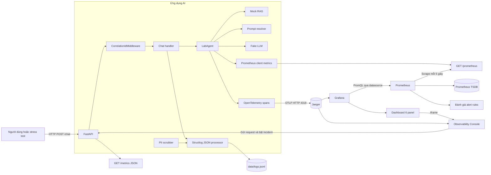
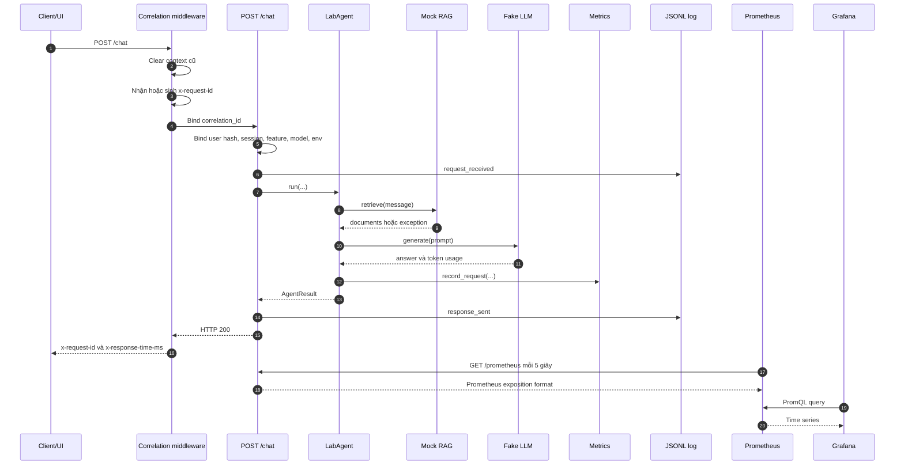
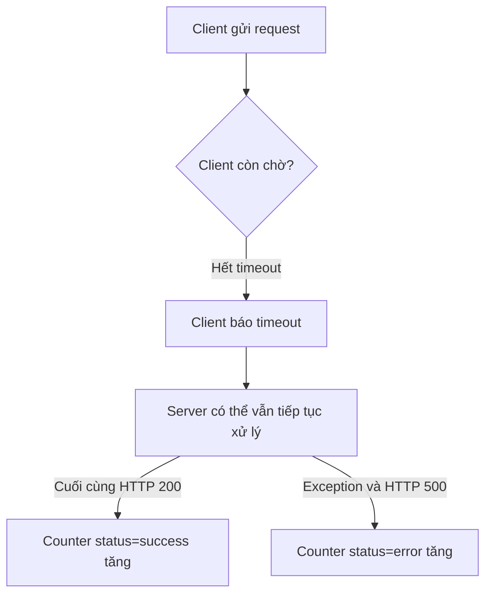
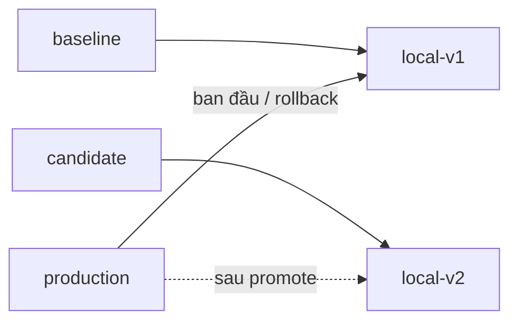
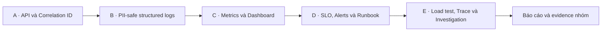

# Báo cáo nhóm Day 13 — Kiến trúc và Observability cho hệ thống AI

## Thông tin bài làm

- Bài lab: **Day 13 — Observability cho hệ thống AI**
- Dashboard runtime: **Prometheus + Grafana**
- Giao diện điều khiển: <http://127.0.0.1:8000/>

### Danh sách thành viên và phân công

Việc phân công Thành viên A đến E được ánh xạ đúng theo thứ tự danh sách nhóm cung cấp:

| Thứ tự | Thành viên | Mã sinh viên | Vai trò | Phạm vi phụ trách chính |
|---|---|---|---|---|
| A | **Nguyễn Gia Bảo** | **2A202601938** | API & Middleware | CP1 Middleware, Correlation ID và exception handler cho `/chat` ở phần mở rộng. |
| B | **Nguyễn Lê Minh** | **2A202601573** | Security Engineer | CP1 PII scrubbing, regex patterns và kiểm chứng structured log không lộ PII. |
| C | **Đỗ Hùng Anh** | **2A202601175** | Metrics & Dashboard | CP1/CP2 đo `error_rate_pct`, định nghĩa metrics và thiết kế dashboard sáu nhóm chỉ số. |
| D | **Nguyễn Tuấn Anh** | **2A202601669** | SRE & Alerts Engineer | CP2 thiết lập SLO, alert rules và alert runbook xử lý sự cố. |
| E | **Nguyễn Thị Lý** | **2A202601962** | QA & Chief Investigator | Load test, trace RAG/LLM, điều tra Challenge CP3 và tổng hợp báo cáo nhóm. |

Nhóm triển khai theo chuỗi phụ thuộc: **A → B → C → D → E**. API và correlation context được hoàn thiện trước; lớp bảo vệ log được gắn tiếp theo; metrics/dashboard sử dụng các sự kiện đã chuẩn hóa; SLO/alerts dựa trên metrics; cuối cùng QA tạo tải, đối chiếu metrics–traces–logs và kết luận nguyên nhân sự cố.

## 1. Mục tiêu của bài lab

Bài lab biến một API AI vốn chỉ trả kết quả thành một hệ thống có thể quan sát được. Sau khi hoàn thành, hệ thống phải trả lời được các câu hỏi:

1. Hệ thống đang nhận bao nhiêu request?
2. Request mất bao lâu, đặc biệt là P95 và P99?
3. Bao nhiêu request thực sự thất bại ở server và lỗi thuộc loại nào?
4. Mỗi request tiêu thụ bao nhiêu token và chi phí ước tính là bao nhiêu?
5. Chất lượng phản hồi có đang thấp hơn mục tiêu không?
6. Khi có sự cố, request nào bị ảnh hưởng và nguyên nhân nằm ở bước nào?
7. Log có vô tình chứa email, điện thoại, CCCD, thẻ hoặc hộ chiếu không?

Ba loại dữ liệu quan sát được dùng với vai trò khác nhau:

- **Metrics** cho biết hệ thống đang tốt hay xấu và xu hướng thay đổi theo thời gian.
- **Traces** cho biết một request đã đi qua các bước nào và bước nào chậm hoặc lỗi.
- **Logs** cung cấp sự kiện chi tiết, correlation ID và bằng chứng để giải thích nguyên nhân.

## 2. Sơ đồ kiến trúc tổng thể



Luồng chính gồm bốn lớp:

1. **Sinh traffic:** trình duyệt, script load test hoặc Observability Console gửi request.
2. **Xử lý request:** FastAPI gắn correlation ID, gọi agent, RAG, prompt và fake LLM.
3. **Phát telemetry:** ứng dụng ghi JSON log, cập nhật metrics và luôn gửi OpenTelemetry trace đến Jaeger local.
4. **Quan sát:** Prometheus scrape metrics; Grafana chạy PromQL và vẽ dashboard; người dùng xem ngay trong console.

## 3. Luồng xử lý của một request



Nếu RAG hoặc tool ném exception, `POST /chat` gọi `record_error()`, ghi event `request_failed` và trả HTTP 500. Vì vậy server error sẽ xuất hiện trong counter của Prometheus và trong panel Error Rate.

## 4. Mỗi bộ phận làm gì?

| Bộ phận | Tệp chính | Nhiệm vụ |
|---|---|---|
| FastAPI application | `app/main.py` | Cung cấp `/health`, `/chat`, `/metrics`, `/prometheus`, `/prompts`, API incident/prompt và giao diện `/`. |
| Correlation middleware | `app/middleware.py` | Xóa context cũ; nhận `x-request-id` hoặc sinh `req-xxxxxxxx`; gắn ID vào log, request state và response header. |
| AI agent | `app/agent.py` | Gọi RAG, resolve prompt, fake LLM; tính latency, token, cost, quality; cập nhật trace và metrics. |
| Mock RAG | `app/mock_rag.py` | Trả tài liệu giả; dùng `rag_slow` để tạo độ trễ 2,5 giây và `tool_fail` để tạo `RuntimeError`. |
| Fake LLM | `app/mock_llm.py` | Sinh câu trả lời và token usage giả; `cost_spike` nhân output token lên bốn lần. |
| Metrics module | `app/metrics.py` | Giữ snapshot JSON trong bộ nhớ và cập nhật các Counter, Histogram, Summary của Prometheus. |
| Structured logging | `app/logging_config.py` | Gộp contextvars, thêm timestamp/level, scrub PII đệ quy và ghi mỗi event thành một dòng JSONL. |
| PII protection | `app/pii.py` | Che email, điện thoại Việt Nam, CCCD, thẻ tín dụng, hộ chiếu; hash user ID; rút gọn preview. |
| OpenTelemetry tracing | `app/otel_tracing.py`, `app/middleware.py`, `app/agent.py` | Tạo root/child spans, export OTLP sang Jaeger và cung cấp trace ID để nối với logs. |
| Trace query | `app/observability_api.py` | Đọc Jaeger Query API, chuẩn hóa trace summary/waterfall và chỉ trả span attributes an toàn cho UI. |
| Prompt management | `app/prompt_management.py`, `config/prompts.json` | Quản lý local v1/v2, label baseline/candidate/production, promote/rollback; Langfuse là backend managed tùy chọn. |
| Incident controller | `app/incidents.py` | Giữ trạng thái `rag_slow`, `tool_fail`, `cost_spike` cho practice/challenge. |
| JSON log storage | `data/logs.jsonl` | Nguồn log chuẩn của lab, dùng để validate schema, enrichment, correlation ID và PII. |
| Prometheus exporter | `GET /prometheus` | Xuất metrics ở Prometheus text exposition format cho máy Prometheus scrape. |
| Debug snapshot | `GET /metrics` | Trả JSON snapshot để UI và người học xem nhanh; endpoint này không phải endpoint Prometheus scrape. |
| Prometheus server | `compose.observability.yaml`, `observability/prometheus/` | Scrape `/prometheus`, lưu time series trong TSDB và đánh giá ba alert rule. |
| Grafana | `observability/grafana/` | Query Prometheus, provision datasource/dashboard và visualize sáu nhóm chỉ số. |
| Observability Console | `app/static/` | Nhúng Grafana, gửi request, stress test, điều khiển incident và hiển thị kết quả trực tiếp. |
| Validators/tests | `scripts/validate_*.py`, `tests/` | Kiểm tra log, dashboard contract, exporter, alert rules, UI và hành vi request. |

## 5. Metrics được tạo như thế nào?

### 5.1 Điểm phát metrics

Metrics không được Prometheus tự suy ra từ log. Khi `LabAgent.run()` xử lý thành công, code gọi trực tiếp:

```python
metrics.record_request(
    latency_ms=latency_ms,
    cost_usd=cost_usd,
    tokens_in=response.usage.input_tokens,
    tokens_out=response.usage.output_tokens,
    quality_score=quality_score,
    feature=feature,
)
```

Khi request lỗi, handler gọi:

```python
record_error(error_type, feature=body.feature)
```

Log và metrics được phát tại cùng các mốc xử lý canonical. Log giữ chi tiết từng request; metrics tổng hợp các request thành time series để truy vấn nhanh.

### 5.2 Danh sách metrics

| Metric | Loại | Labels | Cách cập nhật | Ý nghĩa |
|---|---|---|---|---|
| `day13_ai_requests_total` | Counter | `feature`, `status` | Tăng 1 khi request kết thúc thành công hoặc lỗi | Tổng request đã có kết quả theo feature và outcome. |
| `day13_ai_request_latency_seconds` | Histogram | `feature` | Observe latency thành công, đổi từ ms sang giây | Tạo các series `_bucket`, `_sum`, `_count` để tính P50/P95/P99. |
| `day13_ai_cost_usd_total` | Counter | `feature` | Tăng theo chi phí ước tính của request | Tổng chi phí tích lũy; dùng `rate()` để đổi thành USD/phút. |
| `day13_ai_tokens_total` | Counter | `feature`, `direction` | Tăng theo input/output tokens | Token throughput theo chiều `input` và `output`. |
| `day13_ai_quality_score` | Summary | `feature` | Observe quality score từ 0 đến 1 | Sinh `_sum` và `_count`; trung bình bằng `sum/count`. |
| `day13_ai_errors_total` | Counter | `feature`, `error_type` | Tăng khi server bắt exception | Breakdown lỗi theo loại, ví dụ `RuntimeError`. |

### 5.3 Kiểm soát cardinality và PII trong labels

Prometheus tạo một time series riêng cho mỗi tổ hợp label. Nếu đưa user ID, session ID hoặc feature tùy ý vào label, số series có thể tăng không giới hạn và có nguy cơ lộ PII.

Project chỉ cho phép các feature:

```text
qa, summary, refund, monitoring, other
```

Error type cũng bị giới hạn:

```text
ConnectionError, RuntimeError, TimeoutError, ValueError, other
```

Giá trị ngoài allowlist được chuyển thành `other`. User ID và session ID chỉ nằm trong log/trace theo cơ chế an toàn, không được đưa vào Prometheus labels.

### 5.4 Khởi tạo series bằng 0

`_initialize_metric_series()` tạo trước mọi tổ hợp metric hợp lệ với giá trị 0. Việc này giúp Prometheus thấy baseline trước burst traffic đầu tiên; nếu series chỉ xuất hiện sau khi counter đã tăng, `rate()` có thể cần thêm chu kỳ scrape mới tính được tốc độ.

### 5.5 Hai endpoint metrics khác nhau

- `GET /metrics`: JSON snapshot phục vụ debug và các con số tóm tắt trên Observability Console.
- `GET /prometheus`: định dạng text chuẩn do `prometheus_client.generate_latest()` sinh ra; Prometheus scrape endpoint này.

Ví dụ kiểm tra:

```bash
curl http://127.0.0.1:8000/metrics
curl http://127.0.0.1:8000/prometheus
```

## 6. Prometheus lấy metrics như thế nào?

```mermaid
flowchart LR
    R[Request hoàn tất] --> C[Counter inc]
    R --> H[Histogram observe]
    R --> S[Summary observe]
    C --> E[/prometheus exporter]
    H --> E
    S --> E
    E -->|HTTP pull mỗi 5 giây| P[Prometheus]
    P --> T[(TSDB time series)]
    T --> Q[PromQL]
    T --> A[Alert evaluation mỗi 15 giây]
    Q --> G[Grafana]
```

Prometheus dùng mô hình **pull**, nghĩa là ứng dụng không chủ động gửi metrics sang Prometheus. Quy trình cụ thể:

1. Ứng dụng cập nhật các metric object trong bộ nhớ process Python.
2. Endpoint `/prometheus` render trạng thái hiện tại thành exposition format.
3. Prometheus đọc `observability/prometheus/prometheus.yml`.
4. Cứ mỗi 5 giây, Prometheus gọi `http://host.docker.internal:8000/prometheus`.
5. Mỗi lần scrape tạo một sample có timestamp trong Prometheus TSDB.
6. PromQL so sánh các sample trong một cửa sổ thời gian để tính rate, percentile hoặc trung bình.
7. Cứ mỗi 15 giây, Prometheus đánh giá các alert rule.

Cấu hình scrape chính:

```yaml
global:
  scrape_interval: 5s
  evaluation_interval: 15s

scrape_configs:
  - job_name: day13-ai-api
    metrics_path: /prometheus
    static_configs:
      - targets: [host.docker.internal:8000]
```

`host.docker.internal` được dùng vì Prometheus chạy trong container nhưng API FastAPI chạy trên máy host. Docker Compose map `host.docker.internal:host-gateway` để container truy cập được cổng 8000 của host.

Prometheus lưu dữ liệu ở named volume `prometheus-data` và project đặt retention là 2 ngày. Target phải ở trạng thái `UP` tại <http://localhost:9090/targets>. Nếu `/prometheus` không phản hồi trước scrape timeout, target sẽ tạm thời chuyển `DOWN`.

### Vì sao phải chờ sau khi stress test?

Một rate cần tối thiểu nhiều hơn một sample để biết counter đã thay đổi bao nhiêu theo thời gian. Với scrape interval 5 giây, nên chờ khoảng 5–10 giây sau khi tạo traffic để Prometheus có đủ sample và Grafana refresh.

## 7. Grafana visualize dữ liệu như thế nào?

Grafana không đọc trực tiếp `data/logs.jsonl`. Trong runtime hiện tại:

1. Grafana được provision datasource UID `prometheus-day13`.
2. Datasource trỏ đến `http://prometheus:9090` trong Docker network.
3. Dashboard JSON được mount vào `/var/lib/grafana/dashboards`.
4. Grafana gửi PromQL đến Prometheus.
5. Prometheus trả time series theo time range.
6. Grafana vẽ đường, legend, unit và threshold của từng panel.

Dashboard có UID `day13-ai-observability`, time range mặc định 1 giờ và refresh 30 giây. Khi nhúng vào Observability Console, URL iframe đặt time range 15 phút và refresh 5 giây để thao tác lab phản hồi nhanh hơn.

### Sáu panel của dashboard

| Panel | PromQL chính | Grafana hiển thị | Threshold/SLO |
|---|---|---|---|
| Latency percentiles | `histogram_quantile(0.50/0.95/0.99, sum by (le) (rate(..._bucket[$__rate_interval]))) * 1000` | Ba đường P50, P95, P99 theo ms | P95 không quá 3000 ms. |
| Request traffic | `sum(rate(day13_ai_requests_total[$__rate_interval])) * 60` | Request mỗi phút | Tối thiểu 1 request/phút khi demo. |
| Error rate and breakdown | `100 * error_rate / all_rate` và `sum by (error_type)(rate(day13_ai_errors_total[...])) * 60` | Tỷ lệ lỗi phần trăm và lỗi/phút theo loại | Error rate không quá 2%. |
| Cost over time | `sum(rate(day13_ai_cost_usd_total[$__rate_interval])) * 60` | USD/phút | Mốc ngân sách 2,50 USD. |
| Input and output tokens | `sum by (direction)(rate(day13_ai_tokens_total[...])) * 60` | Input/output token mỗi phút | Mốc 50.000 token. |
| Quality proxy | `sum(rate(quality_sum[...])) / sum(rate(quality_count[...]))` | Điểm chất lượng trung bình 0–1 | Trung bình tối thiểu 0,75. |

### Ý nghĩa các hàm PromQL quan trọng

- `rate(counter[window])`: tốc độ tăng trung bình mỗi giây của counter trong một cửa sổ.
- `* 60`: đổi tốc độ mỗi giây thành mỗi phút.
- `sum(...)`: cộng các feature/status thành số toàn hệ thống.
- `sum by (label)`: cộng nhưng giữ lại từng nhóm label.
- `histogram_quantile(0.95, ...)`: ước lượng P95 từ histogram buckets.
- `clamp_min(value, 0.000001)`: tránh phép chia cho 0 khi chưa có traffic.
- `$__rate_interval`: Grafana tự chọn cửa sổ rate phù hợp với time range và độ phân giải panel.

## 8. SLO, alert và runbook

SLO trong `config/slo.yaml` dùng cửa sổ 28 ngày:

| SLI | Mục tiêu |
|---|---|
| Latency P95 | Không quá 3000 ms; target 99,5%. |
| Error rate | Không quá 2%; target 99%. |
| Daily cost | Không quá 2,50 USD. |
| Quality score trung bình | Tối thiểu 0,75; target 95%. |

Prometheus nạp ba rule thực thi từ `observability/prometheus/alerts.yml`:

1. `Day13HighLatencyP95`: P95 lớn hơn 3 giây liên tục 5 phút.
2. `Day13HighErrorRate`: error rate lớn hơn 2% liên tục 5 phút.
3. `Day13LowQualityScore`: quality trung bình nhỏ hơn 0,75, có traffic và kéo dài 10 phút.

Một điều kiện vượt ngưỡng chỉ đưa alert sang trạng thái `Pending`. Alert chỉ chuyển thành `Firing` khi điều kiện còn đúng đủ thời gian trong trường `for`.

Runbook tóm tắt:

| Alert | Ba bước kiểm tra đầu tiên | Mitigation | Owner |
|---|---|---|---|
| `Day13HighLatencyP95` | Xác nhận time range → mở trace chậm → tìm log cùng correlation ID | Giảm concurrency, tắt incident/feature chậm hoặc dùng retrieval fallback | `observability` |
| `Day13HighErrorRate` | Xem error breakdown → mở trace lỗi → tìm `request_failed` cùng correlation ID | Tắt feature lỗi, rollback release hoặc chuyển fallback | `api` |
| `Day13LowQualityScore` | Chia trace theo prompt version → so sánh retrieval/generation → kiểm tra fallback | Rollback `production` về prompt baseline | `ai-quality` |

## 9. Nhóm đã hoàn thành các TODO trong source như thế nào?

Phần này đối chiếu với TODO gốc trong commit nền của repo.

### TODO 1: Đăng ký PII scrubbing processor

**Vị trí gốc:** `app/logging_config.py`

**Vấn đề:** `scrub_event` đã tồn tại nhưng chưa được đưa vào chuỗi processor của structlog. Cách cũ cũng chỉ che string trực tiếp bên trong `payload`.

**Cách làm:**

- Đăng ký `scrub_event` trước bước render và ghi JSON.
- Viết `_scrub_value()` đệ quy qua string, dictionary, list và tuple.
- Áp dụng scrub cho toàn bộ `event_dict`, không chỉ `payload`.

**Kết quả:** PII được che trước khi xuất hiện trên terminal và trước khi ghi vào `data/logs.jsonl`.

### TODO 2: Bổ sung PII pattern

**Vị trí gốc:** `app/pii.py`

**Vấn đề:** Repo yêu cầu bổ sung loại PII như hộ chiếu hoặc địa chỉ Việt Nam.

**Cách làm:** thêm regex hộ chiếu Việt Nam `\b[A-Z]\d{7,8}\b`, bên cạnh email, số điện thoại, CCCD và thẻ tín dụng đã có.

**Kết quả:** giá trị khớp được thay bằng `[REDACTED_PASSPORT_VN]`. User ID được SHA-256 và chỉ giữ 12 ký tự đầu.

### TODO 3: Xóa contextvars giữa các request

**Vị trí gốc:** `app/middleware.py`

**Vấn đề:** worker có thể tái sử dụng context; nếu không xóa, metadata của request trước có thể rò sang request sau.

**Cách làm:** gọi `clear_contextvars()` ngay đầu middleware.

**Kết quả:** mỗi request có context độc lập.

### TODO 4: Nhận hoặc sinh correlation ID

**Vị trí gốc:** `app/middleware.py`

**Vấn đề:** giá trị ban đầu là `MISSING`.

**Cách làm:**

- Nếu client gửi `x-request-id`, dùng giá trị đó.
- Nếu không, sinh `req-` cộng 8 ký tự hex từ UUID.

**Kết quả:** mọi request đều có ID dùng để nối request, response, log và evidence.

### TODO 5: Bind correlation ID vào structured log

**Vị trí gốc:** `app/middleware.py`

**Cách làm:** gọi `bind_contextvars(correlation_id=correlation_id)` và lưu ID vào `request.state.correlation_id`.

**Kết quả:** mọi log sinh trong request tự động có cùng `correlation_id`; response body cũng trả đúng ID đó.

### TODO 6: Thêm correlation ID và processing time vào response

**Vị trí gốc:** `app/middleware.py`

**Cách làm:** đo `time.perf_counter()` trước và sau `call_next()`, sau đó thêm:

```text
x-request-id: req-xxxxxxxx
x-response-time-ms: <thời gian xử lý>
```

**Kết quả:** client có thể đối chiếu response với log và biết latency nhìn từ middleware.

### TODO 7: Enrich log bằng request context

**Vị trí gốc:** `app/main.py`

**Cách làm:** trước event `request_received`, bind các trường:

- `user_id_hash`: user ID đã hash.
- `session_id`: phiên làm việc.
- `feature`: chức năng `qa`, `summary`, `refund` hoặc `monitoring`.
- `model`: model agent đang khai báo.
- `env`: môi trường từ `APP_ENV`.

**Kết quả:** các event `request_received`, `response_sent` và `request_failed` có đủ metadata để lọc và điều tra.

### TODO 8: Hoàn thiện ba alert rule trong config

**Vị trí gốc:** `config/alert_rules.yaml`

**Vấn đề:** tên, severity, condition và owner đều là `TODO`.

**Cách làm:** hoàn thiện ba alert symptom-based:

| Alert config | Severity | Condition | Owner |
|---|---|---|---|
| `high_p95_latency` | warning | P95 > 3000 ms trong 5 phút | observability |
| `high_error_rate` | critical | Error rate > 2% trong 5 phút | api |
| `low_quality_score` | warning | Mean quality < 0,75 trong 10 phút | ai-quality |

Sau đó chuyển cùng logic thành PromQL thực thi trong `observability/prometheus/alerts.yml` và gắn link runbook.

### TODO 9: Hoàn thiện mô tả SLO

**Vị trí:** `config/slo.yaml`

Dòng placeholder được thay bằng mục tiêu rõ ràng: 99,5% cửa sổ đo trong 28 ngày phải giữ P95 không quá 3 giây. Các mục tiêu error, cost và quality được giữ thống nhất với dashboard/alert.

## 10. Các phần bổ sung ngoài TODO gốc

Để dùng Prometheus + Grafana và demo trực tiếp, bài làm bổ sung:

1. Sáu Prometheus metrics trong `app/metrics.py`.
2. Endpoint `/prometheus` dùng Prometheus exposition format.
3. Allowlist label để tránh cardinality không giới hạn và PII.
4. Khởi tạo series giá trị 0 để rate hoạt động ổn định từ burst đầu.
5. Docker Compose cho Prometheus 3.13.1 và Grafana 13.1.1.
6. Prometheus scrape config, retention, TSDB và ba alert rule.
7. Grafana datasource/dashboard được provision hoàn toàn từ file trong Git.
8. Dashboard đúng sáu panel theo `config/dashboard.yaml`.
9. Observability Console nhúng Grafana và chạy stress test ngay trên UI.
10. Tests cho exporter, dashboard, alert rules, console và Grafana embedding.

## 11. Đối chiếu toàn bộ yêu cầu của bài lab

| Yêu cầu | Trạng thái | Cách thực hiện/evidence |
|---|---|---|
| Hoàn thiện TODO trong `app/` và `config/` | Hoàn thành | Không còn TODO source; chi tiết ở mục 9. |
| JSON logging và correlation ID | Hoàn thành | Structlog JSONL, middleware, response headers. |
| Log enrichment | Hoàn thành | User hash, session, feature, model, env. |
| PII redaction | Hoàn thành | Scrubber đệ quy; validator hiện không phát hiện PII leak. |
| Metrics latency/error/token/cost/quality | Hoàn thành | Prometheus Counter, Histogram, Summary. |
| Dashboard đúng 6 panel | Hoàn thành | Validator báo `6/6 panel`; Grafana được provision thành công. |
| SLO, alert, runbook | Hoàn thành | 4 SLI/SLO, 3 Prometheus alerts và runbook ngay trong mục 8. |
| Stress test và incident | Hoàn thành | Script CLI và UI; có `rag_slow`, `tool_fail`, `cost_spike`. |
| Điều tra challenge | Hoàn thành bằng metrics và logs | Xác định `rag_slow`, blocking `time.sleep(2.5)`, correlation ID và fix action. |
| Tối thiểu 10 traces | Hoàn thành bằng OpenTelemetry + Jaeger | Lần kiểm tra có 17 request traces; trace thành công có 7 spans và trace lỗi có exception span. |
| Prompt v1/v2, label và rollback | Hoàn thành bằng local registry + Jaeger | Baseline/candidate, promote và rollback có trace ID thật trong mục 15; Langfuse là tùy chọn. |
| Ảnh dashboard, Targets và Alerts | **Cần lưu vào submission** | Runtime đã hoạt động; cần chụp và đặt trong `submission/evidence/`. |
| Commit/push và SHA cuối | **Cần thực hiện khi nộp** | Sau khi commit toàn bộ working tree, cập nhật SHA trong report. |

Việc ghi rõ các mục chưa có evidence tránh nhầm giữa “code đã hỗ trợ” và “đã có bằng chứng runtime để chấm điểm”.

## 12. Cách test toàn bộ luồng

### Khởi động API

```bash
.venv/bin/uvicorn app.main:app --host 0.0.0.0 --port 8000 --env-file .env
```

### Khởi động Prometheus và Grafana

```bash
docker compose -f compose.observability.yaml up -d
```

### Mở các giao diện

- Observability Console: <http://127.0.0.1:8000/>
- Prometheus Targets: <http://localhost:9090/targets>
- Prometheus Alerts: <http://localhost:9090/alerts>
- Grafana: <http://localhost:3000/d/day13-ai-observability>

### Tạo traffic

Trong mục **Chạy nhanh**, chọn **Gửi 1 request** hoặc **Gửi baseline 10 request**, rồi bấm nút chạy. Cũng có thể dùng **Bắt đầu stress test** để tùy chỉnh tổng request, concurrency và timeout. Từ terminal:

```bash
python scripts/load_test.py --concurrency 5
```

Sau đó chờ 5–10 giây để Prometheus scrape và Grafana refresh.

### Test latency

```bash
python scripts/inject_incident.py --scenario rag_slow
python scripts/load_test.py --concurrency 5
python scripts/inject_incident.py --scenario rag_slow --disable
```

Kỳ vọng: P95/P99 tăng. Do `time.sleep(2.5)` chặn event loop, client latency có thể lớn hơn nhiều so với latency nội bộ của một agent call.

### Test server error rate

```bash
python scripts/inject_incident.py --scenario tool_fail
python scripts/load_test.py --concurrency 5
python scripts/inject_incident.py --scenario tool_fail --disable
```

Kỳ vọng: `/chat` trả HTTP 500, `day13_ai_requests_total{status="error"}` và `day13_ai_errors_total{error_type="RuntimeError"}` tăng, panel Error Rate thay đổi.

### Test cost/token

```bash
python scripts/inject_incident.py --scenario cost_spike
python scripts/load_test.py --concurrency 5
python scripts/inject_incident.py --scenario cost_spike --disable
```

Kỳ vọng: output tokens tăng bốn lần, kéo theo token throughput và cost rate tăng.

### Chạy validation

```bash
python -m pytest -q
python scripts/validate_logs.py
python scripts/validate_dashboard.py
```

Kết quả gần nhất của bài làm:

- `40 passed`.
- Log validator: `100/100`, không phát hiện PII leak.
- Dashboard validator: `HỢP LỆ: 6/6 panel`.

## 13. Vì sao terminal timeout nhưng Error Rate có thể vẫn bằng 0?

Client timeout và server error là hai sự kiện khác nhau:



Panel Error Rate hiện tính từ `day13_ai_requests_total{status="error"}`, tức là lỗi mà **server đã ghi nhận**. Nếu client dừng chờ sau 3 giây nhưng server tiếp tục và hoàn thành HTTP 200, server không gọi `record_error()`, nên Error Rate vẫn 0%.

Muốn test panel Error Rate chắc chắn, dùng incident `tool_fail`. Trong hệ thống production nên bổ sung metric ở gateway/client cho client timeout, cancellation và connection reset để quan sát cả hai phía.

## 14. OpenTelemetry, Jaeger, logs và xác định bước lỗi

OpenTelemetry tạo một root server span và các child spans:

```text
POST /chat
└── ai.agent.run
    ├── rag.retrieve
    ├── prompt.resolve
    ├── llm.generate
    ├── quality.calculate
    └── metrics.record
```

SDK gửi spans bằng OTLP HTTP tới Jaeger. Response có `x-trace-id`; structured logs có `trace_id`, `span_id` và `correlation_id`, vì vậy có thể đi từ một dòng log sang đúng trace waterfall.

Khi `tool_fail` ném `RuntimeError("Vector store timeout")`, span sâu nhất `rag.retrieve` được UI đánh dấu **NGUỒN LỖI**. `ai.agent.run` và `POST /chat` được đánh dấu **LAN TRUYỀN**. Exception message được scrub PII và exception event chỉ ghi một lần. API chỉ trả allowlist attributes an toàn, không proxy toàn bộ payload Jaeger.

Ví dụ trace lỗi đã kiểm chứng:

```text
Trace ID: eafa606aab26b669e82d4664b18aeb0d
Error step: rag.retrieve
Error type: RuntimeError
Message: Vector store timeout
```

Structured Logs hiển thị tối đa 500 event. Một request thành công có `request_received → response_sent`; request lỗi có `request_received → request_failed`. Khi người dùng bấm trace/correlation ID, UI ghi rõ `đang lọc`; bấm **Bỏ lọc** để xem toàn bộ.

Jaeger local dùng memory storage nên trace mất khi container restart. Với production cần persistent storage, sampling, retention, authentication, TLS và kiểm soát prompt/content nhạy cảm.

## 15. Prompt versioning không phụ thuộc Langfuse

Local prompt registry nằm ở `config/prompts.json`; label runtime được lưu tại `data/prompt_labels.json` và file này không commit. Contract:

| Label | Version mặc định | Vai trò |
|---|---|---|
| `baseline` | `local-v1` | Bản chuẩn đã xác minh |
| `candidate` | `local-v2` | Bản thử nghiệm có instruction ngắn gọn/evidence |
| `production` | `local-v1` | Con trỏ deploy, có thể promote hoặc rollback |

### 15.1 Version khác label như thế nào?

- **Version** là một snapshot nội dung prompt. `local-v1` và `local-v2` đại diện cho hai template khác nhau; sau khi phát hành không nên sửa nội dung ngay trên cùng version.
- **Label** là tên trỏ tới một version. Label có thể di chuyển mà không sửa version: `baseline → local-v1`, `candidate → local-v2`.
- `production` là label mà request thông thường sử dụng. Promote nghĩa là chuyển con trỏ `production` từ v1 sang v2; rollback nghĩa là chuyển con trỏ về v1.



Version vẫn tồn tại sau khi label di chuyển. Vì vậy rollback không cần viết lại prompt hoặc deploy lại source; chỉ cần đổi `production` về version baseline đã biết là an toàn.

### 15.2 Nội dung `local-v1` và `local-v2` khác nhau ở đâu?

`local-v1` là baseline tối giản:

```text
Feature={{feature}}
Docs={{docs}}
Question={{message}}
```

`local-v2` giữ nguyên toàn bộ context của v1 và thêm response policy:

```text
Feature={{feature}}
Docs={{docs}}
Question={{message}}
Instructions=Answer in at most three concise sentences and cite the retrieved evidence.
```

So sánh:

| Thuộc tính | `local-v1` | `local-v2` |
|---|---|---|
| Vai trò | Baseline ổn định | Candidate để thử nghiệm |
| Context đầu vào | Feature, documents, question | Giống v1 |
| Instruction bổ sung | Không có | Tối đa 3 câu và dẫn evidence retrieval |
| Kỳ vọng với LLM thật | Không ép format cụ thể | Ngắn gọn hơn, bám documents rõ hơn |
| Input tokens trong lần test cùng input | 31 | 53 |
| Chênh lệch đã đo | — | Tăng 22 input tokens do instruction mới |
| Label mặc định | `baseline` và `production` | `candidate` |

Ví dụ với cùng một request:

```text
Feature=qa
Docs=Metrics detect incidents, traces localize them, logs explain root cause.
Question=Explain how metrics traces and logs connect
```

V2 nối thêm dòng `Instructions=...`; đây là thay đổi thực sự làm input token tăng. Trace candidate phải ghi `gen_ai.prompt.version=local-v2`, không chỉ đổi tên label trên UI.

### 15.3 Vì sao câu trả lời demo có thể vẫn giống nhau?

Project đang dùng `FakeLLM`. Hàm `generate()` dùng prompt để ước lượng `input_tokens`, nhưng trả một chuỗi answer cố định và chọn `output_tokens` ngẫu nhiên. Vì vậy:

- Có thể chứng minh chắc chắn version, label, template và input-token difference.
- Không thể dùng nội dung answer hiện tại để kết luận v2 hay hơn v1.
- Không thể lấy chênh lệch output tokens/cost của chỉ một request làm bằng chứng cho prompt, vì output token đang random.
- Khi thay FakeLLM bằng LLM thật, instruction của v2 mới có thể làm câu trả lời ngắn hơn và dẫn evidence rõ hơn.

Mục tiêu rubric của phần này là **truy xuất đúng version, đổi label và rollback có evidence**, không phải chứng minh chất lượng candidate bằng fake output.

### 15.4 Cách đọc một trace prompt

Mở trace và chọn span `prompt.resolve`:

```text
gen_ai.prompt.name=day13-chat
gen_ai.prompt.label=candidate
gen_ai.prompt.version=local-v2
gen_ai.prompt.source=local
```

Ý nghĩa: request xin label `candidate`; tại thời điểm resolve, label đó đang trỏ tới `local-v2`; template đến từ local registry chứ không phải Langfuse. Span `ai.agent.run` lặp lại label/version để có thể lọc trace ở cấp agent.

Mỗi request nhận `prompt_label`. Response, JSON log và spans `prompt.resolve`/`ai.agent.run` ghi:

```text
gen_ai.prompt.name
gen_ai.prompt.label
gen_ai.prompt.version
gen_ai.prompt.source
```

Nếu có Langfuse credentials, app ưu tiên managed prompt theo cùng name/label. Nếu không có, `prompt_source=local`; nếu Langfuse lỗi, `prompt_source=local-fallback`. App không giả managed version.

### 15.5 Quy trình test, promote và rollback trên UI

Thao tác trên UI:

1. **Test baseline** tạo trace `baseline → local-v1`.
2. **Test candidate** tạo trace `candidate → local-v2`.
3. **Promote candidate** chuyển `production → local-v2`.
4. Gửi request với label `production` để chứng minh version mới.
5. **Rollback baseline** trả `production → local-v1`.
6. Mở trace và so sánh name/label/version/source.

### 15.6 API tương đương

```bash
curl http://127.0.0.1:8000/prompts

curl -X POST http://127.0.0.1:8000/chat \
  -H 'Content-Type: application/json' \
  -d '{"user_id":"prompt-demo","session_id":"baseline","feature":"qa","message":"Explain observability","prompt_label":"baseline"}'

curl -X POST http://127.0.0.1:8000/prompts/labels/production \
  -H 'Content-Type: application/json' \
  -d '{"version":"local-v2"}'

curl -X POST http://127.0.0.1:8000/prompts/rollback
```

Đổi label tạo event `prompt_label_updated`; rollback tạo `prompt_rollback`, đều chứa previous/new version. State được ghi bằng atomic replace.

### 15.7 Runtime evidence thật ngày 2026-08-11

| Hành động | Label | Version | Trace ID | Input tokens |
|---|---|---|---|---:|
| Test baseline | `baseline` | `local-v1` | `d3abf327c642a67daf257619cdcc5937` | 31 |
| Test candidate | `candidate` | `local-v2` | `98d216342dfd841812f240affd186396` | 53 |
| Promote candidate | `production` | `local-v2` | `cbc422849842643c47b7c2e2e5eb3d8a` | 53 |
| Rollback baseline | `production` | `local-v1` | `db42d21a987b2c611ec7ad50674f5cfd` | 31 |

Trạng thái cuối là `production → local-v1`. Jaeger candidate trace xác nhận `gen_ai.prompt.name=day13-chat`, `label=candidate`, `version=local-v2`, `source=local`.

## 16. Challenge và evidence runtime

Challenge K3 dùng `incident=rag_slow`, affected feature `refund`, threshold 2000 ms. Lưu ý `python scripts/load_test.py --challenge --concurrency 5` chỉ tải input challenge; phải bật incident trước:

```bash
python scripts/inject_incident.py
python scripts/load_test.py --challenge --concurrency 5
python scripts/inject_incident.py --disable
```

Kết quả đã kiểm chứng:

```text
latency nội bộ mỗi request: 2655–2660 ms
P95 snapshot:               2660 ms
P99 snapshot:               2660 ms
Prometheus/Grafana P95:     khoảng 2850 ms
Prometheus/Grafana P99:     khoảng 2970 ms
client latency concurrency: có thể tới khoảng 13,3 giây
```

Root cause là `time.sleep(2.5)` trong Mock RAG chặn event loop. Mỗi agent call mất khoảng 2,65 giây, còn request concurrent bị xếp hàng nên latency nhìn từ client lớn hơn. Mitigation: tắt incident, thay blocking I/O bằng async/non-blocking call, thêm timeout/circuit breaker và giới hạn concurrency.

Evidence tổng hợp:

| Evidence | Trạng thái |
|---|---|
| `pytest` | `40 passed` |
| Log validator | `100/100`, 0 PII leak |
| Dashboard validator | `HỢP LỆ: 6/6 panel` |
| Prometheus target | `day13-ai-api` UP ở baseline |
| Grafana | UID `day13-ai-observability`, 6 panels |
| Alerts | 3 Prometheus rules hợp lệ |
| Trace/log correlation | Response/log cùng trace ID và correlation ID |
| Prompt v1/v2/rollback | Bốn trace ID thật trong mục 15 |

Không coi screenshot chưa chụp là evidence đã có. Nếu quy trình nộp yêu cầu ảnh, cần chụp Grafana 6 panel, Prometheus Targets/Alerts và Jaeger waterfall rồi lưu trong `submission/evidence/`.

## 17. Phân công chi tiết và kết quả đóng góp

### 17.1 Thành viên A — Nguyễn Gia Bảo — API & Middleware

**Checkpoint:** CP1 và phần mở rộng API.

**Công việc thực hiện:**

1. Hoàn thiện `CorrelationIdMiddleware`: xóa context cũ ở đầu request, nhận `x-request-id` từ client hoặc sinh ID dạng `req-xxxxxxxx`.
2. Bind `correlation_id` vào `structlog.contextvars` và lưu vào `request.state` để API, log và response dùng cùng một giá trị.
3. Bổ sung response headers `x-request-id`, `x-response-time-ms` và `x-trace-id` khi có trace.
4. Hoàn thiện xử lý exception tại endpoint `/chat`: ghi `request_failed`, tăng error metrics và trả HTTP 500 với loại lỗi đã chuẩn hóa.
5. Mở rộng middleware bằng server span cho `POST /chat`, đánh dấu trạng thái lỗi khi response từ 500 trở lên.

**Tệp/đầu ra chính:** `app/middleware.py`, `app/main.py`, `app/schemas.py`, các test correlation/error trong `tests/test_chat_observability.py` và `tests/test_otel_observability.py`.

**Kết quả bàn giao:** mọi request có correlation ID xuyên suốt request–response–log; lỗi server được ghi nhận nhất quán để Thành viên C tính error rate và Thành viên E điều tra theo ID.

### 17.2 Thành viên B — Nguyễn Lê Minh — Security Engineer

**Checkpoint:** CP1 PII protection.

**Công việc thực hiện:**

1. Viết bộ scrub PII cho email, số điện thoại Việt Nam, CCCD, thẻ tín dụng và hộ chiếu Việt Nam.
2. Gắn processor scrub đệ quy vào pipeline structured logging trước bước render JSON.
3. Hash `user_id`, chỉ ghi message/answer preview đã scrub và không đưa PII vào Prometheus labels.
4. Kiểm chứng độc lập bằng `scripts/validate_logs.py`, trong đó detector của validator không tái sử dụng regex của ứng dụng.
5. Loại `trace_id`, `span_id` và `user_id_hash` khỏi vùng quét PII vì các chuỗi hex ngẫu nhiên đôi khi chứa dãy số giống điện thoại/thẻ; payload, session và correlation ID vẫn được quét để không che giấu PII thật.

**Tệp/đầu ra chính:** `app/pii.py`, `app/logging_config.py`, `config/logging_schema.json`, `scripts/validate_logs.py`, `tests/test_pii.py` và `tests/test_validate_logs.py`.

**Kết quả bàn giao:** log validator đạt `100/100`, không phát hiện PII leak trong tập log kiểm chứng; dữ liệu telemetry đủ an toàn để Thành viên C/D đưa vào giám sát.

### 17.3 Thành viên C — Đỗ Hùng Anh — Metrics & Dashboard

**Checkpoint:** CP1/CP2 metrics và visualization.

**Công việc thực hiện:**

1. Đo traffic, latency, error, token, cost và quality bằng Prometheus Counter/Histogram/Summary.
2. Tính `error_rate_pct` từ tỷ lệ request có `status="error"` trên tổng request trong cùng cửa sổ quan sát.
3. Giới hạn label cardinality bằng allowlist `feature` và `error_type`; khởi tạo series 0 trước traffic đầu tiên.
4. Thiết kế dashboard đúng sáu nhóm: Traffic, Latency P50/P95/P99, Error Rate, Token Usage, Cost và Quality.
5. Provision Prometheus datasource và Grafana dashboard từ file để môi trường có thể dựng lại tự động.

**Tệp/đầu ra chính:** `app/metrics.py`, `config/dashboard.yaml`, `observability/grafana/`, `observability/prometheus/prometheus.yml`, `tests/test_metrics.py`, `tests/test_dashboard_validator.py` và `tests/test_observability_stack.py`.

**Kết quả bàn giao:** `/prometheus` cung cấp time series cho Prometheus; dashboard validator đạt `6/6 panel`; SRE có các SLI thực thi được để đặt SLO và alert.

### 17.4 Thành viên D — Nguyễn Tuấn Anh — SRE & Alerts Engineer

**Checkpoint:** CP2 reliability policy.

**Công việc thực hiện:**

1. Xác định SLO cho P95 latency, error rate, cost và quality cùng cửa sổ đánh giá phù hợp.
2. Viết ba alert symptom-based: `high_p95_latency`, `high_error_rate` và `low_quality_score`.
3. Chuyển điều kiện alert thành PromQL thực thi, bổ sung severity, owner, thời gian `for` và runbook URL.
4. Viết runbook theo quy trình xác nhận triệu chứng → khoanh vùng feature → mở trace → lọc log bằng correlation ID → mitigation → xác minh phục hồi.

**Tệp/đầu ra chính:** `config/slo.yaml`, `config/alert_rules.yaml`, `observability/prometheus/alerts.yml` và phần runbook tại mục 8 của báo cáo này.

**Kết quả bàn giao:** ba alert rules hợp lệ và có người chịu trách nhiệm; QA có tiêu chí rõ ràng để đánh giá challenge thay vì kết luận chỉ từ một request đơn lẻ.

### 17.5 Thành viên E — Nguyễn Thị Lý — QA & Chief Investigator

**Checkpoint:** CP3, tracing mở rộng và báo cáo nhóm.

**Công việc thực hiện:**

1. Chạy baseline, stress test và ba incident `rag_slow`, `tool_fail`, `cost_spike` với concurrency có kiểm soát.
2. Bọc OpenTelemetry spans cho `ai.agent.run`, `rag.retrieve`, `prompt.resolve`, `llm.generate`, `quality.calculate` và `metrics.record`.
3. Đối chiếu response header, trace ID, correlation ID và structured logs để xác định span nguồn lỗi thay vì chỉ nhìn root span.
4. Dẫn dắt Challenge CP3: xác nhận P95/P99 tăng, tìm `rag.retrieve`, nhận diện `time.sleep(2.5)` chặn event loop và đề xuất async I/O, timeout, circuit breaker cùng giới hạn concurrency.
5. Chạy bộ validator/test, tổng hợp evidence và hoàn thiện báo cáo nhóm.

**Tệp/đầu ra chính:** `scripts/load_test.py`, `scripts/inject_incident.py`, `app/otel_tracing.py`, `app/agent.py`, `app/observability_api.py`, các test tracing/load và `submission/REPORT.md`.

**Kết quả bàn giao:** challenge có bằng chứng từ metrics, trace và log; lần kiểm tra gần nhất đạt `40 passed`, log `100/100`, dashboard `6/6 panel`.

### 17.6 Luồng phối hợp giữa các thành viên



Mỗi phần có thể kiểm tra độc lập nhưng đầu ra được nối thành một chuỗi điều tra duy nhất: **request → correlation ID → log an toàn → metrics/dashboard → alert → trace waterfall → root cause → runbook action**.

## 18. Kiểm tra trước khi nộp

- [x] Source không còn TODO trong `app/` và `config/`.
- [x] `pytest`: 40 passed.
- [x] `validate_logs.py`: 100/100.
- [x] `validate_dashboard.py`: 6/6 panel.
- [x] Không phát hiện PII leak trong log được kiểm tra.
- [x] Prometheus config và 3 alert rules hợp lệ.
- [x] Grafana dashboard provision thành công với 6 panel.
- [x] OpenTelemetry gửi trace đến Jaeger và UI xác định span nguồn lỗi.
- [x] Prompt local v1/v2, label, promote/rollback và bốn trace evidence thật.
- [x] Challenge có metric, trace và log/correlation evidence.
- [ ] Chụp dashboard, Prometheus Targets/Alerts và Jaeger nếu rubric bắt buộc ảnh.
- [ ] Commit/push toàn bộ thay đổi rồi cập nhật commit SHA cuối.

## 19. Kết luận

```text
Request → code cập nhật metric → /prometheus → Prometheus scrape/TSDB
        → PromQL → Grafana 6 panel → phát hiện triệu chứng
        → trace waterfall → span nguồn lỗi
        → correlation ID → structured log → xác nhận root cause
```

Prometheus thu thập/lưu time series, tính PromQL và đánh giá alert. Grafana trình bày dashboard. OpenTelemetry/Jaeger định vị bước chậm hoặc lỗi. Structured logs giải thích chi tiết. Local prompt registry cung cấp version/label/rollback có trace evidence mà không cần Langfuse.
