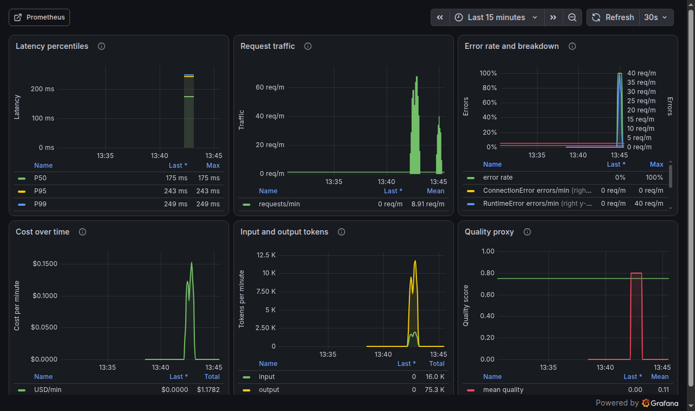
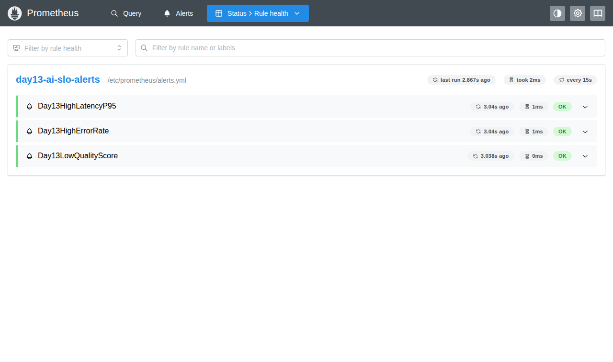
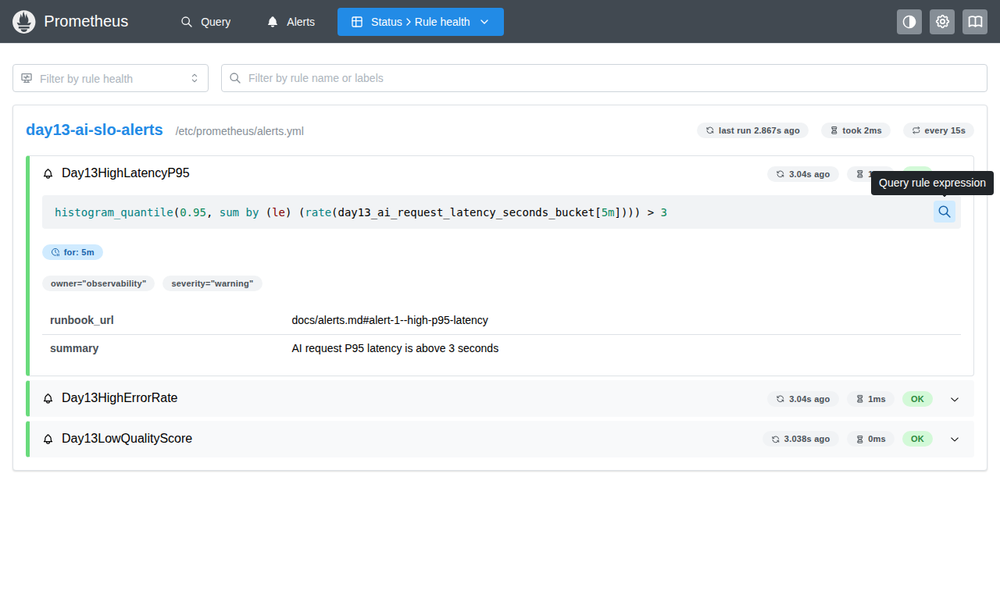
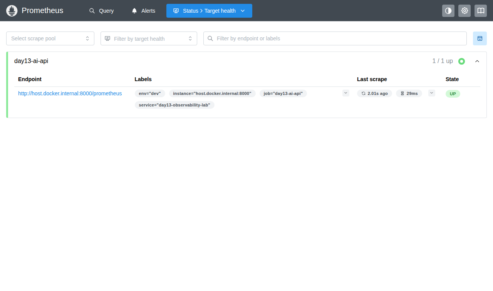
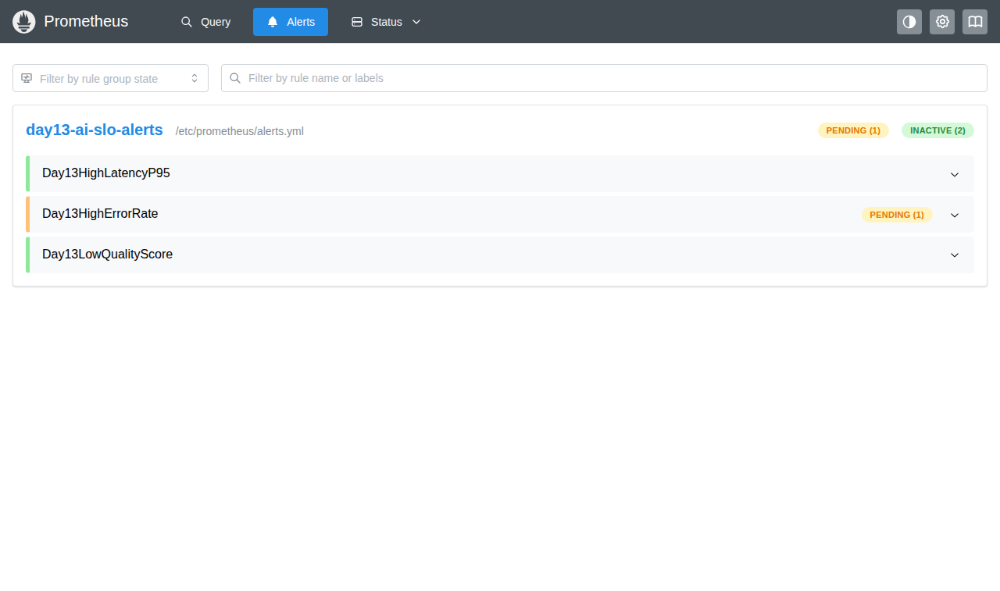

# Bằng chứng đóng góp — Đỗ Hùng Anh (Thành viên C, Metrics & Dashboard)

> Thư mục này **chỉ chứa bằng chứng**, không chứa code.
> Code thật nằm ở nhánh `test`, commit `b090b67`. Toàn bộ nội dung code đó được chép nguyên văn vào file [`code-cua-toi.diff`](code-cua-toi.diff) để ai cũng đọc được mà không cần checkout.

**Người làm:** Đỗ Hùng Anh — MSSV 2A202601175 — Thành viên C — vai trò **Metrics & Dashboard**
**Ngày chụp bằng chứng:** 2026-08-11

---

## Phần 0 — Giải thích nhanh cho người mới

Nếu bạn chưa quen mấy từ này, đọc bảng dưới trước rồi xem ảnh sẽ dễ hiểu hơn:

| Từ | Nghĩa dễ hiểu |
|---|---|
| **Metric** | Một con số mà chương trình tự đếm, ví dụ "đã xử lý 66 request", "tốn 0.11 đô". |
| **Prometheus** | Phần mềm cứ vài giây lại chạy sang hỏi app "số của mày giờ bao nhiêu?" rồi lưu lại theo thời gian. |
| **Scrape / Target** | "Scrape" = hành động đi hỏi đó. "Target" = địa chỉ bị hỏi. Target `UP` nghĩa là hỏi được, `DOWN` là app chết. |
| **Grafana** | Phần mềm vẽ các con số của Prometheus thành biểu đồ cho người xem. |
| **Panel** | Một ô biểu đồ trên Grafana. Bài lab yêu cầu đúng 6 ô. |
| **PromQL** | Ngôn ngữ để hỏi Prometheus, kiểu "cho tao xem tỉ lệ lỗi 5 phút qua". |
| **Histogram** | Kiểu metric chia số đo vào các "ngăn" (dưới 0.1s, dưới 0.5s...) để tính được P95. |
| **P95** | 95% request nhanh hơn con số này. Đo P95 tốt hơn đo trung bình vì trung bình che mất người dùng bị chậm. |
| **Alert** | Luật kiểu "nếu tỉ lệ lỗi > 2% liên tục 5 phút thì báo động". |
| **Runbook** | Tài liệu chỉ dẫn: khi alert kêu thì làm gì, kiểm tra cái gì trước. |
| **SLO** | Mục tiêu chất lượng đã cam kết, ví dụ "P95 phải dưới 3 giây". |

---

## Phần 1 — Năm ảnh bằng chứng

### Ảnh 1 — Dashboard Grafana đủ 6 panel



Đây là 6 ô biểu đồ mà bài lab yêu cầu, đang chạy với dữ liệu thật:

| Ô | Nhìn vào đâu | Đơn vị |
|---|---|---|
| Latency percentiles | P50 = 175 ms, P95 = 243 ms, P99 = 249 ms | ms |
| Request traffic | đỉnh khoảng 60 request/phút | req/m |
| Error rate and breakdown | đường lỗi vọt lên **100%**, `RuntimeError` tối đa 40 req/m | % |
| Cost over time | tổng **$1.1782** | USD |
| Input and output tokens | vào 16.0 K, ra 75.3 K | token |
| Quality proxy | có đường ngưỡng **0.75** nằm ngang | điểm 0–1 |

**Vì sao ảnh này quan trọng:** mỗi ô đều có **tên đúng**, **đơn vị đúng** và **đường ngưỡng (threshold)** nhìn thấy được — đúng ba thứ rubric chấm.

### Ảnh 2 — Prometheus đã nạp 3 alert



Ba alert `Day13HighLatencyP95`, `Day13HighErrorRate`, `Day13LowQualityScore` đã được Prometheus nạp từ file `/etc/prometheus/alerts.yml`, trạng thái `OK`.

### Ảnh 3 — Mở một alert ra xem bên trong (ảnh quan trọng nhất)



Đây là bằng chứng mạnh nhất, vì nó cho thấy alert **không phải hàng giả**:

```promql
histogram_quantile(0.95, sum by (le) (rate(day13_ai_request_latency_seconds_bucket[5m]))) > 3
```

- `for: 5m` — phải sai liên tục 5 phút mới báo, tránh báo động vì một lần chậm.
- `owner="observability"`, `severity="warning"` — ai bị gọi dậy và mức khẩn cấp.
- `runbook_url: docs/alerts.md#alert-1--high-p95-latency` ← **đúng file runbook tôi viết**.

> **Vì sao phải mở ra xem?**
> Trước đây file alert dùng `expr: vector(0) > 1`. Câu này **đúng cú pháp** nên Prometheus vẫn nạp bình thường và vẫn hiện màu xanh `OK` như Ảnh 2 — nhưng nó **không bao giờ báo động**, vì kết quả luôn rỗng.
> Nghĩa là: **nhìn trang `/rules` không phân biệt được alert thật với alert giả.** Chỉ khi mở ra đọc `expr` mới biết. Đây chính là lý do tôi viết thêm cờ `--alerts` cho validator (xem Phần 2).

### Ảnh 4 — Prometheus lấy được số từ app



Target `day13-ai-api` trạng thái **UP**, đang scrape `http://host.docker.internal:8000/prometheus` mỗi vài giây. Nếu ô này `DOWN` thì mọi biểu đồ ở Ảnh 1 đều trống.

### Ảnh 5 — Alert thật sự hoạt động



Tôi bật lỗi giả (`tool_fail`) cho tỉ lệ lỗi lên **25%**, vượt ngưỡng 2%. Kết quả: `Day13HighErrorRate` chuyển sang **PENDING (1)**.

`PENDING` = "đã phát hiện sai, đang đếm đủ 5 phút rồi mới kêu". Đây đúng là bằng chứng lab yêu cầu — chứng minh alert phản ứng với sự cố thật chứ không nằm im.

---

## Phần 2 — Chứng minh code tôi viết

### Tôi đã làm gì, nói bằng lời thường

Khi nhóm gộp code, phần **đo đạc (instrumentation)** và **stack Prometheus/Grafana** đã có sẵn rồi. Nhưng phần **"bản hợp đồng" (contract) và kiểm tra tự động** thì vẫn còn nguyên bản mẫu của thầy — tức là dashboard được mô tả bằng file cũ đọc từ log text, chứ chưa mô tả theo Prometheus.

Nói đơn giản: **biểu đồ thì chạy được, nhưng không có gì tự kiểm tra xem biểu đồ có đúng không.** Việc của tôi là làm phần kiểm tra đó.

### Bảng: trước và sau

| File | Trước (nhánh gốc) | Sau (commit `b090b67`) |
|---|---|---|
| `config/dashboard.yaml` | `schema_version: 1`, đọc từ `data/logs.jsonl`, đơn vị `ms` | `schema_version: 2`, đọc Prometheus, 6 panel kèm PromQL thật |
| `config/slo.yaml` | chỉ có con số mục tiêu | thêm câu **PromQL** để đo từng mục tiêu, đổi giây cho đúng chuẩn |
| `config/alert_rules.yaml` | dạng `alerts:` tự chế — **Prometheus không nạp được** | đúng chuẩn `groups:/rules:` của Prometheus |
| `docs/alerts.md` | **không tồn tại**, dù 6 link `runbook_url` trỏ tới nó | runbook đầy đủ cho 3 alert |
| `scripts/validate_metrics.py` | **không tồn tại** | script mới, chấm điểm `/prometheus` |
| `scripts/validate_dashboard.py` | không có cờ `--alerts` | thêm `--alerts` + chặn PromQL gõ sai tên metric |
| `app/metrics.py` | — | thêm `EXPORTED_METRICS` + `is_exported_metric` (**không sửa phần đo đạc của bạn khác**) |
| `tests/test_metrics.py` | — | thêm test contract + test lỗi phải đếm cả tử số lẫn mẫu số |
| `tests/test_dashboard_validator.py` | — | thêm test bắt được alert giả |

Toàn bộ nội dung thay đổi nằm trong [`code-cua-toi.diff`](code-cua-toi.diff).

### Kiểm tra lại bằng lệnh

Ai cũng có thể tự xác minh:

```bash
git checkout test
git show b090b67          # xem toàn bộ code tôi viết
python -m pytest -q       # 49 passed
```

### Kết quả 3 script kiểm tra (chạy thật, file đính kèm)

| Script | Điểm | File |
|---|---|---|
| `validate_metrics.py` | **100/100**, cả 6 panel `PASSED`, target Prometheus `up` | [ketqua_validate_metrics.txt](ketqua_validate_metrics.txt) |
| `validate_dashboard.py --alerts` | **6/6 panel hợp lệ + 3 alert hợp lệ** | [ketqua_validate_dashboard.txt](ketqua_validate_dashboard.txt) |
| `validate_logs.py` | **100/100**, 0 rò rỉ PII | [ketqua_validate_logs.txt](ketqua_validate_logs.txt) |

### Ba điều tôi học được và giải thích được

**1. Lỗi phải được đếm hai lần, không phải một.**
Tỉ lệ lỗi là một phép chia. Một request lỗi **vẫn là một request**, nên nó phải làm tăng cả tử số (số lỗi) lẫn mẫu số (tổng request). Nếu chỉ đếm tử số, biểu đồ sẽ luôn báo tỉ lệ lỗi thấp hơn thực tế. Tôi viết hẳn một test khoá tính chất này lại.

**2. Mẫu số phải có `clamp_min`.**
Lúc chưa có ai dùng app, tổng request = 0. Chia cho 0 ra `NaN` và biểu đồ **trống trơn** thay vì hiện `0%`. `clamp_min(..., 0.000001)` giữ mẫu số khác 0 một chút để biểu đồ luôn hiện số.

**3. Đặt tên `feature` sai có thể làm lộ thông tin cá nhân.**
`feature` lấy từ request của người dùng. Nếu ai đó gửi `feature = "student@example.com"` thì email đó biến thành **tên metric vĩnh viễn** trong Prometheus — nơi không có bộ lọc PII như log và không xoá được dễ dàng. Vì vậy code chỉ chấp nhận danh sách cố định `{qa, summary, refund, monitoring}`, còn lại gom hết vào `other`.

---

## Phần 3 — Cách tự dựng lại để kiểm chứng

```bash
# 1. Bật Prometheus + Grafana + Jaeger
docker compose -f compose.observability.yaml up -d

# 2. Chạy app
uvicorn app.main:app --host 0.0.0.0

# 3. Tạo dữ liệu
python scripts/load_test.py

# 4. Chấm điểm
python scripts/validate_metrics.py
python scripts/validate_dashboard.py --alerts
python scripts/validate_logs.py
```

> **Lưu ý quan trọng khi chấm log:** file `data/logs.jsonl` bị `.gitignore` nên nó **cộng dồn** qua nhiều lần chạy. Nếu còn log cũ từ lúc code chưa xong, `validate_logs.py` sẽ báo điểm thấp (tôi từng bị **50/100**) dù code hoàn toàn đúng. Xoá trắng file rồi chạy lại là được **100/100**:
>
> ```bash
> : > data/logs.jsonl
> ```
